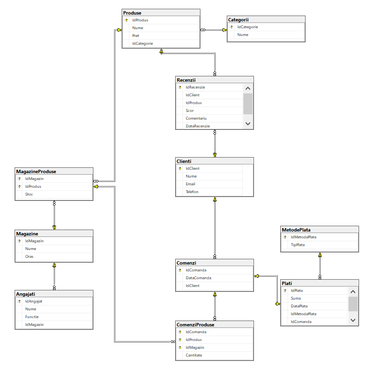

# MagazinDB – Bază de Date pentru Magazin

## 📘 Descriere
Această bază de date modelează un sistem simplu pentru gestionarea produselor, magazinelor, clienților și comenzilor.

## 🧱 Structura bazei de date
Baza conține 11 tabele:
- `Produse`, `Categorii`, `Magazine`, `Clienti`, `Angajati`
- `Comenzi`, `Plati`, `MetodePlata`, `Recenzii`
- Tabele de legătură (M:N): `MagazineProduse`, `ComenziProduse`

## 🛠 Funcționalități implementate

- ✅ Proceduri CRUD cu validări
- ✅ Funcții
- ✅ View-uri
- ✅ Indexuri NON-CLUSTERED
- ✅ Testare performanță
- ✅ Versionare structură

## 🖼 Diagrama bazei de date

## 🧪 Cum rulezi proiectul

1. Restore `MagazinDB.bak` sau atașează `.mdf/.ldf` din fisierul Baza_date
2. Consulta si fisierul SQL_Restore

